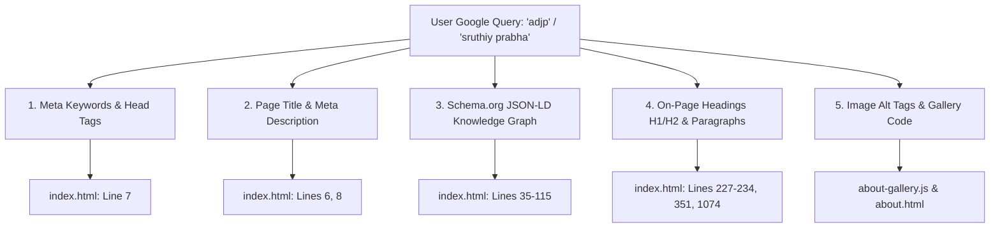

# ADJP Creative — Master SEO Keywords Reference (`KEYWORDS.md`)

> **Website:** [https://adjpcreative.com/](https://adjpcreative.com/)  
> **Brand Entities:** `adjp` | `adjp creative` | `adjpcreative`  
> **Founder Entity:** `sruthiy prabha` | `sruthi prabha`  
> **Last Updated:** September 2026  

---

## Quick Navigation

- [1. P0 Critical Brand Keywords](#1-p0-critical-brand-keywords)
- [2. Founder & Key Person Keywords (Sruthiy Prabha)](#2-founder--key-person-keywords-sruthiy-prabha)
- [3. Commercials & Advertising Agency Keywords](#3-commercials--advertising-agency-keywords)
- [4. Music Direction & Brand Jingles Keywords](#4-music-direction--brand-jingles-keywords)
- [5. Feature Films, Cinema & Direction Keywords](#5-feature-films-cinema--direction-keywords)
- [6. Industry-Specific Vertical Keywords](#6-industry-specific-vertical-keywords)
- [7. Geographic & Location-Based Keywords](#7-geographic--location-based-keywords)
- [8. High-Intent Long-Tail & Question Queries](#8-high-intent-long-tail--question-queries)
- [9. Exact Placement in Website Code](#9-exact-placement-in-website-code)
- [10. Ready-to-Copy Comma-Separated Meta Lists](#10-ready-to-copy-comma-separated-meta-lists)

---

## 1. P0 Critical Brand Keywords

*These are the primary search terms users and clients type into Google. The objective is 100% position #1 ranking, sitelinks, and Knowledge Panel takeover.*

| # | Keyword | Search Intent | Monthly Search Priority | Target Landing URL |
|---|---|---|---|---|
| 1 | `adjp` | Navigational | **P0 (Critical)** | `https://adjpcreative.com/` |
| 2 | `adjp creative` | Navigational | **P0 (Critical)** | `https://adjpcreative.com/` |
| 3 | `adjpcreative` | Navigational | **P0 (Critical)** | `https://adjpcreative.com/` |
| 4 | `adjp creative agency` | Commercial | **P1 (High)** | `https://adjpcreative.com/` |
| 5 | `adjp productions` | Navigational | **P1 (High)** | `https://adjpcreative.com/` |
| 6 | `adjp colombo` | Local Navigational | **P1 (High)** | `https://adjpcreative.com/contact` |
| 7 | `adjp creative sri lanka` | Local Navigational | **P1 (High)** | `https://adjpcreative.com/` |
| 8 | `adjp studio` | Navigational | **P1 (High)** | `https://adjpcreative.com/portfolio` |
| 9 | `adjp advertising` | Commercial | **P1 (High)** | `https://adjpcreative.com/` |
| 10 | `adjp media` | Navigational | **P2 (Medium)** | `https://adjpcreative.com/` |

---

## 2. Founder & Key Person Keywords (Sruthiy Prabha)

*These terms link the personal brand of veteran filmmaker and composer Sruthiy Prabha with ADJP Creative.*

| # | Keyword | Category | Recommended Target Page | Recommended On-Page Placement |
|---|---|---|---|---|
| 1 | `sruthiy prabha` | Primary Name | `/about` | `<title>`, `<h1>`, Schema `Person`, Bio |
| 2 | `sruthi prabha` | Common Alternate Spelling | `/about` | Schema `alternateName`, Image `alt` tags |
| 3 | `sruthiyprabha` | Slug / Username | `/about` | `<meta name="keywords">`, URL anchors |
| 4 | `sruthy prabha` | Phonetic Variant | `/about` | Schema `alternateName` |
| 5 | `music director sruthiy prabha` | Professional Title | `/about` & `/` | Section Headings, Schema `jobTitle` |
| 6 | `film director sruthiy prabha` | Professional Title | `/about` & `/portfolio` | Section Headings, Schema `jobTitle` |
| 7 | `sruthiy prabha songs` | Music Catalog | `/` (Music Videos) | Video titles, YouTube embed descriptions |
| 8 | `sruthiy prabha composer` | Music Industry | `/about` | Bio text, Schema `knowsAbout` |
| 9 | `sruthiy prabha jingles` | Advertising Audio | `/` & `/about` | Audio player titles |
| 10 | `sruthiy prabha abhitha` | Film Career | `/about` & `/portfolio` | Film showcase description |
| 11 | `sruthiy band sri lanka` | Musical Heritage | `/about` | Heritage & Milestones story |
| 12 | `sruthiy prabha colombo` | Local Entity | `/contact` & `/about` | Bio schema address |
| 13 | `sruthiy prabha chennai` | Regional Authority | `/about` | Cine Musicians Union mention |

---

## 3. Commercials & Advertising Agency Keywords

*B2B commercial keywords targeting marketing managers, CMOs, and corporate clients seeking video ad production.*

| # | Keyword | Intent | Target Market | Target Page |
|---|---|---|---|---|
| 1 | `advertising agency sri lanka` | Commercial / B2B | Sri Lanka / Global | `https://adjpcreative.com/` |
| 2 | `advertising agencies in colombo` | Local Commercial | Colombo | `https://adjpcreative.com/` |
| 3 | `tv commercial production colombo` | Transactional | Colombo | `https://adjpcreative.com/` |
| 4 | `tv commercial production sri lanka` | Transactional | National | `https://adjpcreative.com/` |
| 5 | `commercial video production chennai` | Regional / South India | Chennai / TN | `https://adjpcreative.com/portfolio` |
| 6 | `creative production company sri lanka` | B2B Commercial | National | `https://adjpcreative.com/about` |
| 7 | `tv ad production house colombo` | Transactional | Colombo | `https://adjpcreative.com/` |
| 8 | `brand video production agency` | Commercial | Global | `https://adjpcreative.com/portfolio` |
| 9 | `corporate film makers in sri lanka` | Commercial | Sri Lanka | `https://adjpcreative.com/portfolio` |
| 10 | `best advertising agency colombo` | Evaluative / High Intent | Colombo | `https://adjpcreative.com/` |
| 11 | `creative agency sri lanka` | Commercial | National | `https://adjpcreative.com/` |
| 12 | `video ad makers colombo` | Transactional | Colombo | `https://adjpcreative.com/portfolio` |

---

## 4. Music Direction & Brand Jingles Keywords

*Targeting audio branding, catchy commercial jingles, film scores, and corporate theme songs.*

| # | Keyword | Specialization | Intent | Target Page |
|---|---|---|---|---|
| 1 | `brand jingles sri lanka` | Audio Branding | Transactional | `https://adjpcreative.com/` |
| 2 | `commercial jingle composer` | Audio Composition | Commercial | `https://adjpcreative.com/about` |
| 3 | `tamil brand jingles` | Regional Language | Commercial | `https://adjpcreative.com/` |
| 4 | `sinhala brand jingles` | Regional Language | Commercial | `https://adjpcreative.com/` |
| 5 | `advertising song composer chennai` | South Indian Market | Commercial | `https://adjpcreative.com/` |
| 6 | `sound design and audio production colombo`| Studio Services | Transactional | `https://adjpcreative.com/contact` |
| 7 | `original music scoring for ads` | Custom Music | Commercial | `https://adjpcreative.com/` |
| 8 | `radio commercial audio production sri lanka`| Radio Spots | Transactional | `https://adjpcreative.com/` |
| 9 | `corporate anthem music composer` | Corporate Audio | Commercial | `https://adjpcreative.com/about` |
| 10 | `tv ad background score composer` | Film/Ad Music | Commercial | `https://adjpcreative.com/about` |

---

## 5. Feature Films, Cinema & Direction Keywords

*Targeting cinema, film producers, theatrical distributors, and festival organizers.*

| # | Keyword | Type | Intent | Target Page |
|---|---|---|---|---|
| 1 | `film production house sri lanka` | Studio Production | Transactional | `https://adjpcreative.com/` |
| 2 | `abhitha movie director` | Feature Film Entity | Informational | `https://adjpcreative.com/about` |
| 3 | `abhitha film sruthiy prabha` | Direct Work Association | Informational | `https://adjpcreative.com/about` |
| 4 | `south indian cinema music composer` | Industry Authority | Informational / Commercial | `https://adjpcreative.com/about` |
| 5 | `cine musicians union composer chennai`| Professional Credential| Informational | `https://adjpcreative.com/about` |
| 6 | `feature film makers in colombo` | Film Production | Transactional | `https://adjpcreative.com/portfolio` |
| 7 | `tamil film director colombo` | Creative Leadership | Informational / B2B | `https://adjpcreative.com/about` |
| 8 | `movie sound direction sri lanka` | Audio Post-Production | Commercial | `https://adjpcreative.com/about` |
| 9 | `independent film production sri lanka`| Cinema | Commercial | `https://adjpcreative.com/portfolio` |

---

## 6. Industry-Specific Vertical Keywords

*Targeting specific corporate sectors where ADJP Creative has proven 35+ year case studies:*

### A. Jewellery & Luxury Retail
- `jewellery commercial director`
- `jewellery advertisement video makers colombo`
- `gold jewellery ad campaign sri lanka`
- `jewellery brand film production chennai`

### B. Banking, Finance & Insurance (BFSI)
- `bank tv commercial production sri lanka`
- `finance company ad production colombo`
- `insurance commercial video makers`
- `lb finance commercial music composer`

### C. FMCG, Food & Beverages
- `food beverage commercial production sri lanka`
- `fmcg advertisement production colombo`
- `biscuit brand tv ad production`
- `snack and confectionery video commercial`

### D. Fashion, Textiles & Retail
- `textile brand ads sri lanka`
- `saree commercial makers chennai`
- `fashion brand film makers colombo`
- `retail showroom ad campaign production`

---

## 7. Geographic & Location-Based Keywords

*For winning "near me" and localized searches across Sri Lanka, South India, and international hubs:*

| Region / City | Target Keywords |
|---|---|
| **Colombo (Local)** | `adjp colombo`, `advertising agency colombo 06`, `tv commercial makers colombo`, `film production harmers avenue colombo`, `creative agency wellawatte colombo` |
| **Sri Lanka (National)** | `adjp creative sri lanka`, `top advertising agency sri lanka`, `best commercial production house sri lanka`, `famous music director sri lanka sruthiy prabha` |
| **Chennai / Tamil Nadu** | `commercial video production chennai`, `cine musicians union composer chennai`, `tamil advertising jingle composer chennai` |
| **Global Diaspora (UK, Canada, Australia)** | `sri lankan advertising agency international`, `tamil video commercial production global`, `south asian brand jingles` |

---

## 8. High-Intent Long-Tail & Question Queries

*Ideal for blog posts, FAQ schemas, and voice search (Google Assistant, Siri):*

1. *"Who is the director of Abhitha movie?"*
   - Target URL: `https://adjpcreative.com/about`
2. *"Who founded ADJP Creative agency?"*
   - Target URL: `https://adjpcreative.com/about`
3. *"Who is Sruthiy Prabha?"*
   - Target URL: `https://adjpcreative.com/about`
4. *"Best advertising agency in Colombo for TV commercials"*
   - Target URL: `https://adjpcreative.com/`
5. *"How to produce a TV commercial in Sri Lanka?"*
   - Target URL: `https://adjpcreative.com/blog` & `/contact`
6. *"Who composed music for LB Finance commercials?"*
   - Target URL: `https://adjpcreative.com/`
7. *"Experienced brand jingle composers in Colombo and Chennai"*
   - Target URL: `https://adjpcreative.com/about`

---

## 9. Exact Placement in Website Code

Search engines scan these exact locations in your project files:



### File Breakdown:

1. **`index.html`**
   - **Line 6:** `<meta name="description" content="ADJP Creative (adjpcreative / ADJP)...">`
   - **Line 7:** `<meta name="keywords" content="adjp, adjp creative, adjpcreative, sruthiy prabha, ...">`
   - **Line 8:** `<title>ADJP Creative (adjpcreative) — Commercials, Music & Film Production | Sruthiy Prabha</title>`
   - **Lines 35–115:** Schema.org JSON-LD structured data with `alternateName: ["ADJP", "adjpcreative", ...]`.
   - **Line 227:** Hero `<h1>` accessible tag.
   - **Line 232:** Hero description paragraph.
   - **Line 351:** What We Do intro paragraph.
   - **Lines 1074–1100:** Footer agency bio.

2. **`about.html`**
   - **Line 6–8:** About page meta description, keywords, and title.
   - **Lines 31–118:** Schema.org `AboutPage`, `Organization`, and `Person` (Sruthiy Prabha).
   - **Line 282:** Milestone biography copy.
   - **Line 296:** Gallery images `alt` attributes.

3. **`portfolio.html`**
   - **Lines 6–8:** Portfolio meta tags.
   - **Schema.org:** CreativeWork showcases.

4. **`contact.html`**
   - **Lines 6–8:** Contact page meta tags.
   - **Lines 31–74:** `ContactPage` and `LocalBusiness` Schema with Colombo address and phone coordinates.

5. **`js/about-gallery.js`**
   - **Lines 8–110:** All 21 gallery items contain descriptive `alt` attributes with `Sruthiy Prabha` and `ADJP Creative`.

---

## 10. Ready-to-Copy Comma-Separated Meta Lists

Use these clean lists when submitting your website to business directories, social media profiles, YouTube channel tags, or press releases:

### A. Core Brand & Founder (Primary Meta Keywords):
```text
adjp, adjp creative, adjpcreative, sruthiy prabha, sruthi prabha, sruthiyprabha, music director sruthiy prabha, film director sruthiy prabha, advertising agency sri lanka, commercials chennai, brand jingles, abhitha film, cine musicians union, tv commercials colombo
```

### B. Advertising & Commercial Production:
```text
advertising agency sri lanka, tv commercial production colombo, tv commercial production sri lanka, commercial video production chennai, creative production company sri lanka, tv ad production house colombo, brand video production agency, corporate film makers in sri lanka, best advertising agency colombo, video ad makers colombo
```

### C. Music Direction & Audio Branding:
```text
brand jingles sri lanka, commercial jingle composer, tamil brand jingles, sinhala brand jingles, advertising song composer chennai, sound design and audio production colombo, original music scoring for ads, radio commercial audio production sri lanka, corporate anthem music composer
```

### D. Cinema & Feature Films:
```text
film production house sri lanka, abhitha movie director, abhitha film sruthiy prabha, south indian cinema music composer, cine musicians union composer chennai, feature film makers in colombo, tamil film director colombo, movie sound direction sri lanka
```

